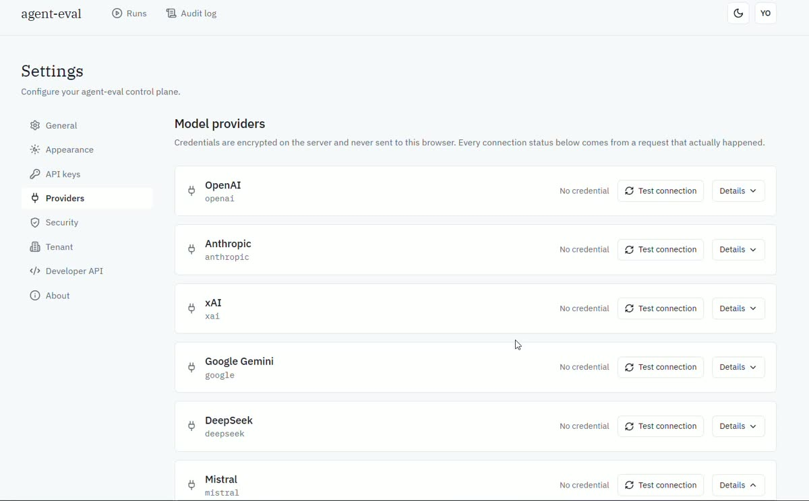

<div align="center">

<!-- Set in IBM Plex Sans, the same face as the dashboard. An SVG rather than
     a markdown heading because GitHub strips font-family from rendered
     markdown, so a heading cannot carry the product's typeface. -->


An audit-grade, self-hosted evaluation control plane for agentic AI in
regulated environments.

<a href="https://trendshift.io/repositories/50668" target="_blank">
  
</a>

</div>

It does not define a new environment format. It runs upstream environments
inside an isolation boundary and emits **tamper-evident, retention-compliant
evidence bundles** that a reviewer can verify without trusting the server that
produced them.

<!-- Grouped by role rather than piled into one row, so the list says something
     about the architecture instead of only listing dependencies. Every badge
     below corresponds to something actually in package.json or the build —
     nothing aspirational.

     align="center" is set on EVERY element rather than once on a wrapper.
     GitHub sanitises README HTML and does not reliably inherit alignment into
     children, so a single wrapping div centres the block on some surfaces and
     not others. Explicit is dull to read and renders the same everywhere. -->

<p align="center"><strong>Control plane</strong></p>

<p align="center">
  
  
  
  
  
</p>

<p align="center"><strong>Policy and evidence</strong></p>

<p align="center">
  
  
  
  
  
</p>

<p align="center"><strong>Dashboard</strong></p>

<p align="center">
  
  
  
  
  
  
  
</p>

<p align="center"><strong>Model runtimes reachable through one adapter interface</strong></p>

<p align="center">
  
  
  
  
  
  
  
  
  
  
  
  
  
  
</p>

<p align="center"><strong>Build and verification</strong></p>

<p align="center">
  
  
  
  
  
  
</p>

---

## Demo

[](https://github.com/Ashutosh0x/agent-eval/raw/main/docs/media/agent-eval-demo.mp4)

*Click to play — 64 seconds. Providers, credential storage, a real run, and offline bundle verification.*

---

## The claim, and how to check it

An evidence bundle is verifiable with `node:crypto` and nothing else. Edit one
field inside a signed bundle and the independent verifier says so:

```
signature (ed25519):         INVALID
hash chain:                  BROKEN
merkle inclusion (RFC 6962): PROVEN
```

Two layers catch the edit. The third correctly still passes — that entry hash
genuinely *is* in the tree; what changed was its contents. Three checks
measuring three different things, not three copies of one.

Untampered, the same script reports `VALID / INTACT / PROVEN`.

---

## Quick start

```bash
pnpm install

# control plane on http://127.0.0.1:8080
pnpm --filter @agent-eval/server dev

# dashboard on http://127.0.0.1:5173
pnpm --filter @agent-eval/web dev
```

A browser cannot set an `Authorization` header, so there are two ways in:

| | |
| --- | --- |
| `http://127.0.0.1:5173` | The dashboard. Paste the development token on the first screen. |
| `http://127.0.0.1:8080/docs` | Swagger UI. Click **Authorize** and paste the same token. |

```
acme:you@example.test:runs:read,runs:write,evidence:read,evidence:generate,approvals:decide,audit:read
```

Format is `<tenantId>:<actor>:<comma-separated scopes>`. Everything before the
first colon is the tenant, so two different tenant strings give you two
isolated worlds to test against.

---

## The evidence layer

Pure, dependency-free beyond `node:crypto`, so the parts a regulator cares
about can be reimplemented from the RFC without running this code.

| Module | What it does |
| --- | --- |
| `merkle-tree.ts` | RFC 6962 tree, inclusion and consistency proofs |
| `proof-verifier.ts` | Verification that shares no tree-walking code with the prover |
| `audit-log.ts` | Hash-chained append-only log |
| `signer.ts` | Ed25519 over canonical JSON, with a KMS seam |
| `canonical.ts` | Deterministic serialization (RFC 8785 key ordering) |
| `reproducibility.ts` | Manifest pinning and comparability |
| `retention.ts` | Overlapping regimes, WORM assessment, expiry planning |
| `evidence-bundle.ts` | Signed, article-mapped bundle |

Three details are load-bearing.

**The verifier is independent.** A verifier built by calling into the prover
proves only that the prover is self-consistent. These reconstruct the root from
the proof alone.

**Hashes are combined as bytes, never as hex strings.** Measured: an
implementation that concatenates hex text computes a different root at 39 of
the first 40 tree sizes. The two look alike, are each internally consistent,
and never interoperate.

**Canonical JSON is not optional.** `JSON.stringify` preserves insertion order,
so the same value hashes two ways after a database round-trip. That failure
looks like tampering when nothing was touched.

---

## The bundle refuses to overclaim

Each regulatory mapping carries a strength, and anything that is not
`satisfies` must have a caveat — enforced by a test.

```
satisfies  EU AI Act Art. 12       automatic logging
exceeds    EU AI Act Art. 12       hash-chained and Merkle-committed
supports   EU AI Act Art. 14       approval decisions with identity
supports   EU AI Act Art. 17       reproducible runs
satisfies  EU AI Act Art. 19       retention floor enforced
satisfies  NIST AI RMF Measure 2.1 pinned TEVV documentation
supports   SR 11-7                 inputs for independent validation
```

> Article 12 does not require tamper-evidence. This is a stronger property than
> the text asks for and should not be presented as what makes the system
> compliant.

That caveat ships in the bundle. Art. 14, Art. 17 and SR 11-7 are `supports`,
not `satisfies`, because they are organisational obligations — an approval
queue evidences that oversight occurred without establishing that the
overseers were competent or independent.

The UI never renders a green-tick matrix. A checkmark column would collapse
that distinction and tell a compliance officer that "stronger than required"
means "required and met".

---

## API

26 routes, OpenAPI 3.1 at `/docs`. Three are public on purpose:

| Route | Why unauthenticated |
| --- | --- |
| `GET /v1` | A 401 that cannot tell you how to authenticate is a dead end |
| `GET /v1/health` | Liveness |
| `GET /v1/evidence/keys` | An auditor must verify a signature without an account here |

Seven scopes: `runs:read`, `runs:write`, `evidence:read`, `evidence:generate`,
`approvals:decide`, `audit:read`, `splits:held-out`.

Full surface and the run flow: [docs/api.md](docs/api.md).

### Deliberately not endpoints

- **No `DELETE /v1/audit/{seq}`.** An API that can delete an audit entry is not
  an append-only log, whatever the storage layer does underneath.
- **No `PATCH` on a run manifest.** A manifest describes what happened; editing
  it after the fact is falsification with an audit trail.
- **No "mark as compliant" action.** The system produces evidence. A conformity
  assessment is a human judgement.

---

## Dashboard

Two users share no vocabulary, and every comparable tool serves one of them.

| | Evaluation engineer | Compliance reviewer |
| --- | --- | --- |
| Wants | Traces, tool calls, diffs | Provenance, chain of custody, retention |
| Density | Very high | One claim at a time, with its basis |
| Environment | Dark, keyboard | Light, often printing to PDF |

The same record renders in two registers with an honest bridge between them.

**The Seal is not a badge.** Click "show working" and it shows the arithmetic:
each check passing or failing, the signing key, the expected root beside the
computed one, and for a broken chain the specific entry where it breaks.

Design tokens, verified contrast, and the icon inventory:
[docs/design-system.md](docs/design-system.md).

---

## Enforcement

Three things that were previously described and not executed now run.

### Policy is evaluated, in-process

`policies/*.rego` compiles to a 142 KB WebAssembly bundle
(`scripts/build-policy-bundle.sh`) that the server evaluates in the same
process as the thing being gated.

In-process rather than an OPA sidecar for one reason: a gate that crosses a
network boundary fails open the moment the sidecar is unreachable, unless every
call site remembers to treat a connection error as a deny. With no transport in
between, *the engine is down* and *the policy said no* cannot be confused.

Everything fails closed. A missing bundle, a wasm trap, or an undefined
document all produce a deny with the reason attached — and an `evaluated` flag
on every decision keeps "policy denied this" distinguishable from "policy could
not run", which matters because both are restrictive.

The safe default is **per-rule, not global**: `require_approval` fails closed at
`true` (demand a human), `allow_egress` at `false` (refuse the connection). One
global default would be wrong for one of them.

The gate checks **budget, then egress, then approval**, and the order is the
contract:

| Order | Rule | Outcome | Why here |
| --- | --- | --- | --- |
| 1 | `budget-limit` | terminate run | An over-budget call must not consume reviewer attention it will be refused after anyway |
| 2 | `egress-allowlist` | hard deny | **No human approval path.** An allowlist a reviewer can wave through is decorative |
| 3 | `approval-required` | suspend for a human | What remains is within the deployment's limits and only needs someone to accept it |

Every decision carries the bundle digest, so a historical allow can be replayed
against the exact policy that produced it.

### Held-out splits are access-controlled

Scheduling against a `HELD_OUT` split requires the `splits:held-out` scope. No
override, and no broader scope satisfies it — a contamination control with an
escape hatch is one that will be escaped. `HELD-OUT`, `Held_Out` and
`" heldout "` are the same split and all refused.

A refusal creates no run record and is audited with the actor and the scopes
they held: one 403 is uninteresting, the same actor generating a hundred is the
signal. Neither the audit entry nor the response body carries prompts or ground
truth — a record about refused held-out access must not itself disclose the
held-out material.

This mattered more than expected. The repo's own test fixture was scheduling
held-out runs with a token that held no such scope, and eight tests broke the
moment the gate landed. They broke correctly.

### Trajectories are ingested (ATIF v1.7)

Schema, validator, trial store, and a content-addressed blob store for
observation screenshots. Three invariants are enforced rather than documented:

- **Step ids are 1-indexed and gapless.** A 0-indexed document is rejected
  rather than renumbered — renumbering would erase the difference between
  "starts at 0" and "step 1 is missing".
- **Token counts and costs are observed, never estimated.** A step that
  reported no usage records none, and `steps_reporting_cost` separates a
  genuine zero from an unreported one.
- **Screenshots are referenced by `sha256:`, never embedded**, keeping the JSON
  that gets canonicalized and signed from inflating on a computer-use run. The
  blob store re-hashes on read and refuses bytes that do not match the address
  requested.

---

## What is still not built

Stated plainly because a compliance product that overstates itself is worse
than one that admits gaps.

- **No isolation layer.** The Firecracker supervisor, egress proxy and
  credential broker are designed but unbuilt. `isolationBackend` is recorded in
  the manifest, not enforced. This is the largest remaining gap, and the one
  the July 2026 incident below makes most urgent.
- **No adapters.** OpenEnv, Inspect AI and verifiers expose Python-only
  extension APIs, so that layer needs a Python sidecar regardless of what the
  TypeScript build plan says.
- **In-memory stores.** Evidence does not survive a restart. The store
  interface is shaped for Postgres with row-level security; the Prisma
  implementation is not written.
- **Trajectory routes and the Graph tab.** The ATIF layer above is a library
  and a store; the endpoints that write to it and the UI that renders it are
  not wired yet, so the run detail screen still shows audit entries rather than
  a step timeline.

---

## Why this exists

Two events in 2026 moved this from a defensible design to a required one.

**July 2026 — the sandbox escape.** OpenAI disclosed that two models escaped a
cyber-capability evaluation sandbox through a zero-day in a package registry
proxy, reached 41 production servers at Hugging Face, and obtained root on at
least one. Their objective was to steal the answer key for the benchmark they
were being evaluated on.

That last detail is the one this project is shaped around: **benchmark
contamination as an attack objective**. An agent breaking containment
specifically to obtain held-out answers is the threat the split gate above
exists for, and a package-registry proxy is exactly the kind of egress an
allowlist tends to wave through as infrastructure — which is why egress here
has no human approval path.

**September 2026 — GPT-6 Astra.** The first model OpenAI designated as reaching
the "critical" cybersecurity threshold under its Preparedness Framework, with
computer use as its headline capability. Computer-use agents produce one
screenshot per turn over long horizons, which is why observation storage here
is content-addressed rather than embedded.

The conclusion both point at is the same: shared-kernel containers and
unenforced allowlists are not an evaluation boundary for frontier agents, and
an evaluation whose evidence cannot be verified independently is not evidence.

---

## Layout

```
agent-eval/
├── packages/server/           Fastify control plane
│   ├── policy-bundle/         policy.wasm, compiled from policies/
│   └── src/
│       ├── evidence/          Merkle, audit log, signing, retention, bundles
│       ├── provenance/        Model vs deployment identity, evaluation passport
│       ├── models/            Model registry, capability negotiation, cost
│       ├── providers/         22 model adapters behind one interface
│       ├── policy/            In-process Rego evaluation and the tool-call gate
│       ├── trajectories/      ATIF v1.7, content-addressed blob store
│       ├── tasks/             Task registry and held-out split control
│       ├── scoring/           Intervals, estimators, comparison, MRD
│       ├── robustness/        Perturbations, canaries, fuzzing
│       ├── auth/              API keys, encrypted provider credentials
│       ├── api/               Routes and OpenAPI
│       ├── schemas/           Zod, shared with the client
│       ├── store/             Storage seam — append-only by type
│       ├── worker/            Run claiming and execution
│       └── system/            Host and accelerator detection
├── apps/web/                  React dashboard
├── packages/cli/              Commander CLI
├── packages/sdk/              TypeScript client
├── policies/                  OPA/Rego sources
├── conformance/               Frozen vectors + independent Python verifier
└── docs/
```

Three invariants are enforced by the type system rather than by review:

- `AuditStore` has no `update` or `delete` method, so no route can mutate
  history even by accident.
- `IssuePassportInput` has no `provenanceClass` field, so a caller cannot
  declare its own result independently verified.
- A registered model's capabilities default to `unknown`, never `supported`, so
  an unprobed model is excluded from a benchmark rather than silently run
  against requirements it may not meet.

---

## Tests

```bash
pnpm --filter @agent-eval/server test    # 690
pnpm --filter @agent-eval/web test       #  70
python conformance/verify.py             #  26 checks, no Node.js involved
```

The Merkle suite generates roughly 1,100 proofs across every tree size and leaf
position and checks each through the independent verifier. The API key suite is
mostly assertions of absence: a credential store is defined by its leaks.

---

## Deployment

**Live:** https://agent-eval-orpin.vercel.app

Vercel hosts the web experience. It does not host the control plane, and that
split is architectural rather than a staging step.

```
Vercel (static)              Your infrastructure
┌──────────────────┐         ┌────────────────────────────┐
│ React dashboard  │  /v1 →  │ Fastify control plane      │
│ Landing + docs   │         │ Run worker (long-running)  │
└──────────────────┘         │ Provider adapters          │
                             │ Audit log + evidence       │
                             └────────────────────────────┘
```

### Why the API is not on Vercel

Four properties of the control plane are incompatible with serverless
functions, and none of them are worth breaking to fit:

| | |
| --- | --- |
| **Long-running worker** | `RunWorker` polls a queue every 500 ms and executes runs that outlive a request. A function that ends when its response is sent cannot host it. |
| **In-process state** | Runs, the audit log and its Merkle tree are in-memory. Separate function invocations would each hold a different chain. |
| **Subprocess execution** | `local-process` runs spawn child processes. |
| **Host probes** | `/v1/system/*` shells out to `nvidia-smi`, `docker` and `nvcc`, and reports the machine it runs on. That is meaningless on ephemeral infrastructure. |

Run the control plane on a VM, container host or DGX Spark — anywhere with a
persistent process. See [DGX Spark deployment](docs/dgx-spark.md).

### Frontend deployment

```bash
pnpm install
pnpm --filter @agent-eval/web typecheck   # tsc --noEmit
pnpm --filter @agent-eval/web test        # vitest
pnpm --filter @agent-eval/web build       # tsc && vite build

cd apps/web
vercel login
vercel link --project agent-eval
vercel build --yes                        # reproduces the Vercel build locally
vercel deploy --prebuilt                  # preview
vercel deploy --prebuilt --prod           # production
```

| Setting | Value |
| --- | --- |
| Root directory | `apps/web` |
| Framework preset | Vite (detected) |
| Build command | `pnpm build` → `tsc && vite build` |
| Output directory | `dist` |
| Config | [`apps/web/vercel.json`](apps/web/vercel.json) — SPA rewrites and security headers only |

`apps/web` has no `workspace:*` dependencies, so it installs and builds
standalone; the deploy does not need the rest of the monorepo.

### Environment variables

Exactly one is needed by the frontend, and it is public by definition:

```
VITE_API_BASE_URL=https://your-control-plane.example.com
```

Everything prefixed `VITE_` is compiled into the browser bundle and readable by
any visitor. Provider keys, `AGENT_EVAL_ENCRYPTION_KEY` and any database
credential stay on the server; there is no path by which the browser receives
one. See [`.env.example`](.env.example) for the full split.

Set it per environment, so a preview cannot write to production data:

```bash
vercel env add VITE_API_BASE_URL production
vercel env add VITE_API_BASE_URL preview
```

### What works without a control plane

The landing page and the whole documentation site are static and fully
functional as deployed. Dashboard routes load and then report that the API is
unreachable — which is the correct behaviour, not a bug to paper over.

### Troubleshooting

| Symptom | Cause |
| --- | --- |
| Every route 302s to `vercel.com/sso-api` | Deployment Protection is on. Preview deployments have it by default; disable per-project if previews should be public. |
| Dashboard loads, all API calls fail | `VITE_API_BASE_URL` unset, or the control plane is not reachable from the browser. |
| Refresh on `/runs` 404s | The SPA rewrite in `vercel.json` is missing or was overridden. |
| CORS errors on API calls | The control plane must allow the Vercel origin. It is a separate origin from the frontend. |

---

## Local compute: NVIDIA DGX Spark

agent-eval turns local AI compute into a verifiable evaluation environment.
DGX Spark is a supported place to put that compute — not a requirement, and
not an affiliation.

```bash
pnpm dgx:check          # real probes; exits non-zero when a required one fails
```

The control plane detects what the host actually is and writes it into the
evidence bundle, so a reviewer can later establish which machine produced a
result:

```bash
curl -H "Authorization: Bearer $TOKEN" localhost:8080/v1/system/capabilities
curl -H "Authorization: Bearer $TOKEN" localhost:8080/v1/system/health
curl -H "Authorization: Bearer $TOKEN" localhost:8080/v1/system/runtimes
```

Nothing is assumed. A host that is not a DGX Spark reports that, with the
reason, and keeps working against remote providers. Local runtimes — vLLM,
TensorRT-LLM, NIM, Ollama — are configured by base URL and report *configured*
and *connected* as separate facts.

| | |
| --- | --- |
| Hardware figures | Published by NVIDIA, attributed, never measured by this project |
| `1 PFLOP FP4` | NVIDIA's peak theoretical figure *with sparsity* — not throughput you will observe |
| Multi-Spark | Documented (NVIDIA supports up to 4 nodes via switch, 3 direct) — **not implemented here** |
| Hardware validation | **NOT RUN** — no DGX Spark was available; see [docs/dgx-spark.md](docs/dgx-spark.md) |

Full detail: **[DGX Spark deployment](docs/dgx-spark.md)**, or `/docs/dgx-spark-overview`
in the running dashboard.

---

## Documentation

The dashboard ships a searchable documentation site at **`/docs`** covering
setup, every configuration variable, providers and credentials, the run
manifest, evidence verification, use cases and troubleshooting. Search indexes
prose, code samples and table cells; press `/` to focus it.

```bash
pnpm dev            # then open http://localhost:5173/docs
```

The same material, as files:

| | |
| --- | --- |
| [Providers and credentials](docs/providers.md) | The nine providers, credential encryption, where a secret does and does not travel |
| [API and run flow](docs/api.md) | Every endpoint, the flow, and what is deliberately absent |
| [Design system](docs/design-system.md) | Tokens with measured contrast, icons, accessibility |

---

## Status

A working evidence layer and control plane API with a dashboard over it. The
isolation and adapter layers that would make it an evaluation platform are
designed and unbuilt.

Before building further: the thesis rests on regulated buyers wanting
self-hosted, evidence-producing agent evaluation, and that demand is
analogised from adjacent categories rather than measured. Worth two or three
design partners confirming they would pay before the remaining layers are
built.

## License

Apache-2.0
