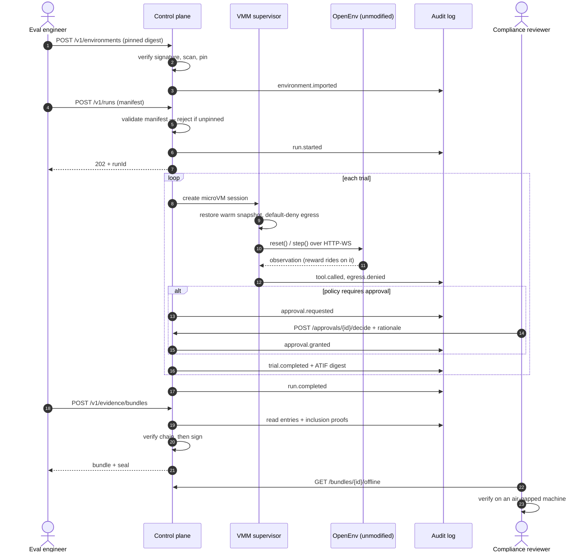

# API surface and run flow

The endpoint design follows one rule: **anything a regulator might need to
check must be reachable without trusting this server.** That single constraint
produces most of the unusual shapes below — the public-key endpoint, the proof
endpoints, the offline verification bundle.

---

## 1. Conventions

**Base:** `/v1`. Versioned in the path because evidence bundles are retained
for years and must stay readable by a client written today.

**Tenancy.** `tenant_id` comes from the JWT claim, never from a path or body
parameter. It is set on the Postgres session so Row-Level Security enforces
isolation in the database rather than in application code — an endpoint that
forgets a `WHERE tenant_id` clause then returns nothing instead of returning
someone else's data.

**Auth.** OIDC bearer tokens. Scopes follow the split between the two users:

| Scope | Grants |
| --- | --- |
| `runs:read` | View runs, trials, trajectories |
| `runs:write` | Start and cancel runs |
| `evidence:read` | View and download bundles |
| `evidence:generate` | Cut a new bundle |
| `approvals:decide` | Approve or reject a gated action |
| `splits:held-out` | Read held-out task splits |
| `audit:read` | Query the audit log and request proofs |

`splits:held-out` is deliberately separate. A held-out split that everyone can
read is not held out, and contamination is invisible after the fact.

**Errors.** RFC 9457 `application/problem+json`:

```json
{
  "type": "https://agent-eval.dev/errors/manifest-incomplete",
  "title": "Run manifest is not reproducible",
  "status": 422,
  "detail": "environment.digest must be pinned as sha256:<64 hex>, got \"env:latest\"",
  "field": "environment.digest"
}
```

**Idempotency.** `POST /runs` and `POST /evidence/bundles` accept an
`Idempotency-Key` header. Both are expensive and both get retried by nervous
clients.

**Pagination.** Cursor-based (`?cursor=&limit=`). Offset pagination over an
append-only log skips rows as it grows, which for an audit trail is a
correctness bug rather than a UX annoyance.

---

## 2. Endpoints

### 2.1 Environments — the unmodified upstream

```http
POST   /v1/environments                    import from a registry or Hub
GET    /v1/environments
GET    /v1/environments/{id}
POST   /v1/environments/{id}/versions      pin a new immutable version
GET    /v1/environments/{id}/versions/{v}
POST   /v1/environments/{id}/scan          re-run vulnerability + signature check
```

Import is the trust boundary. An imported OpenEnv or verifiers package is
untrusted third-party code that will shortly run inside your isolation
boundary, so the response records what was checked:

```json
POST /v1/environments
{ "source": "hub://prime-intellect/swe-gym", "pin": "sha256:9f2a…" }

201 Created
{
  "id": "env_01J…",
  "digest": "sha256:9f2a…",
  "openEnvSpecVersion": 1,
  "supplyChain": {
    "signatureVerified": true,
    "signer": "sigstore:github.com/prime-intellect",
    "slsaProvenance": "level-3",
    "vulnerabilities": { "critical": 0, "high": 2 },
    "scannedAt": "2026-08-30T10:12:00Z"
  }
}
```

`422` if the reference is a tag rather than a digest. A tag can point at
different software tomorrow, so a run against one cannot be reproduced.

### 2.2 Task sets and splits

```http
POST   /v1/tasksets
GET    /v1/tasksets/{id}
GET    /v1/tasksets/{id}/splits
GET    /v1/tasksets/{id}/splits/{split}    requires splits:held-out for held-out
POST   /v1/tasksets/{id}/contamination     check a model against this set
```

Every split response carries its `splitHash`, so a run's manifest can be
compared against the set that exists now.

### 2.3 Verifiers and assurance

```http
POST   /v1/verifiers
GET    /v1/verifiers/{id}
POST   /v1/verifiers/{id}/assurance        run IPT / fuzz / canary
GET    /v1/verifiers/{id}/assurance/{jobId}
GET    /v1/verifiers/{id}/reward-distribution?fromVersion=&toVersion=
```

This is where reward hacking becomes measurable. The assurance job runs
isomorphic perturbation testing, verifier fuzzing, and canary hack-tasks, and
returns rates rather than a pass/fail:

```json
{
  "verifierId": "ver_01J…",
  "version": "3.1.0",
  "isomorphicPerturbation": { "run": true, "invariant": 0.94, "gap": 0.06 },
  "fuzzing": { "mutations": 4820, "rewardSurfaceDefects": 3 },
  "canary": { "tasks": 12, "hackedRate": 0.083, "trend": "rising" },
  "verdict": "review",
  "note": "Canary hack rate rose from 0.02 to 0.083 across two verifier revisions."
}
```

A rising canary score is an early warning, not a failure — the endpoint says
so rather than returning a boolean.

### 2.4 Runs

```http
POST   /v1/runs                    start           202 Accepted
GET    /v1/runs
GET    /v1/runs/{id}
POST   /v1/runs/{id}/cancel
GET    /v1/runs/{id}/events        Server-Sent Events
GET    /v1/runs/{id}/trials
GET    /v1/runs/{id}/manifest
POST   /v1/runs/compare            comparability verdict between two runs
```

`POST /v1/runs` returns **202**, not 201. A run is a long-lived, stateful
session, not a resource that exists the moment you ask for it.

It also **validates the manifest before accepting**. A run that cannot say
what it ran produces a number, not evidence, so the failure belongs at
submission time:

```json
422 Unprocessable Entity
{
  "type": "https://agent-eval.dev/errors/manifest-incomplete",
  "title": "Run manifest is not reproducible",
  "detail": "toolchain must record at least the platform version",
  "field": "toolchain"
}
```

`POST /v1/runs/compare` answers the question a model-risk reviewer actually
asks — *is this quarter's score better, or did something change underneath?*

```json
{ "runA": "run_01…", "runB": "run_02…" }

200 OK
{
  "comparable": false,
  "differences": ["model.sampling", "isolationBackend"],
  "note": "Scores from these runs cannot be compared directly."
}
```

**Progress is SSE, not WebSocket.** The client only ever reads, SSE reconnects
with `Last-Event-ID` for free, and it survives corporate proxies that break
WebSocket upgrades — which is exactly the network a regulated buyer runs.

```
event: trial.completed
id: 42
data: {"trialId":"trial_01…","taskId":"t-17","reward":0.0,"status":"failed"}

event: approval.required
id: 43
data: {"approvalId":"apr_01…","action":"write:production","deadline":"2026-08-30T11:00:00Z"}
```

### 2.5 Trials and trajectories

```http
GET    /v1/trials/{id}
GET    /v1/trials/{id}/trajectory              ATIF v1.7 JSON
GET    /v1/trials/{id}/trajectory/steps/{n}
GET    /v1/trials/{id}/trajectory/images/{ref} content-addressed blob
GET    /v1/trials/{id}/trajectory.otel         ATIF → OTel spans
```

Trajectories follow ATIF: `step_id` sequential **from 1** (0 is a validation
error), `trajectory_id` distinct from the run-scoped `session_id`, and images
as **separate blobs referenced by relative path**, never inlined. A
computer-use run generates gigabytes of screenshots; inlining them makes the
trajectory undownloadable.

The `.otel` projection carries cost in **ATIF metrics, not OTel attributes** —
OTel GenAI semconv issue #287 (cost conventions) is unresolved, so anything
written into attributes now will need migrating.

### 2.6 Approvals — the Article 14 surface

```http
GET    /v1/approvals?status=pending
GET    /v1/approvals/{id}
POST   /v1/approvals/{id}/decide
GET    /v1/approvals/policies
```

The only endpoint where a human blocks a machine, so it captures what
non-repudiation requires:

```json
POST /v1/approvals/apr_01…/decide
{
  "decision": "reject",
  "rationale": "Writes to the production ledger are out of scope for this eval."
}
```

`rationale` is **mandatory**, including on approve. An approval with no
recorded reason evidences that a click happened, not that oversight occurred.

Each pending item states **what happens if nobody acts**:

```json
{
  "id": "apr_01…",
  "action": "write:production",
  "deadline": "2026-08-30T11:00:00Z",
  "onTimeout": "deny",
  "trajectoryContext": { "trialId": "trial_01…", "throughStep": 47 }
}
```

A silent timeout default is a governance hazard. Making it a required field
means somebody decided it.

### 2.7 Evidence

```http
POST   /v1/evidence/bundles                    generate + sign
GET    /v1/evidence/bundles
GET    /v1/evidence/bundles/{id}
GET    /v1/evidence/bundles/{id}/download      ?format=json|pdf
POST   /v1/evidence/bundles/{id}/verify        server-side re-check
GET    /v1/evidence/bundles/{id}/offline       self-contained verify kit
GET    /v1/evidence/keys                       public keys, no auth
```

Two endpoints here matter more than the rest.

**`GET /v1/evidence/keys` is unauthenticated.** An auditor must be able to
verify a bundle without an account on the system that produced it. Requiring a
login to check a signature would make the signature meaningless.

```json
{
  "keys": [
    {
      "keyId": "kms-2026-q1",
      "algorithm": "ed25519",
      "publicKeyPem": "-----BEGIN PUBLIC KEY-----\n…",
      "validFrom": "2026-01-01T00:00:00Z",
      "validUntil": null
    },
    { "keyId": "kms-2025-q4", "…": "…", "validUntil": "2026-01-01T00:00:00Z" }
  ]
}
```

Rotated keys stay published forever. A signature from a retired key must still
verify, or every historical bundle silently becomes unverifiable on rotation
day.

**`GET .../offline`** returns a zip containing the bundle, the public key, a
standalone verifier script, and a README with the RFC 6962 formulas — enough
for a reviewer to check the evidence on an air-gapped machine with no
dependency on this software. That is the difference between an audit trail and
audit evidence.

### 2.8 Audit log and proofs

```http
GET    /v1/audit?actor=&action=&from=&to=&cursor=
GET    /v1/audit/{seq}
GET    /v1/audit/root
GET    /v1/audit/{seq}/inclusion-proof
GET    /v1/audit/consistency-proof?from={size}
POST   /v1/audit/verify
```

`GET /v1/audit/root` is the endpoint to publish or anchor. Give a
counterparty today's root, and any future consistency proof lets them confirm
nothing before it was altered.

```json
GET /v1/audit/root
{
  "root": "4a7f…",
  "size": 184203,
  "anchoredAt": {
    "wormObject": "s3://evidence-t1/roots/2026-08-30.json",
    "objectLockRetainUntil": "2027-03-01T00:00:00Z"
  }
}
```

An inclusion proof returns the **entry hash as the leaf**, not the payload, so
inclusion can be proved without disclosing the entry's contents — which is
what makes selective disclosure to an auditor possible.

---

## 3. The complete flow

One run, from import to a bundle an auditor accepts.



### What the flow guarantees, step by step

| Stage | Guarantee | Enforced by |
| --- | --- | --- |
| Import | Third-party code is pinned, signed, scanned | `422` on an unpinned reference |
| Run start | The run can state exactly what it ran | Manifest validation before `202` |
| Execution | Agent code runs behind a guest kernel, no ambient credentials, default-deny egress | Supervisor; the API never touches the VM |
| Approval | A named human decided, with a reason | `rationale` required; `onTimeout` explicit |
| Bundling | Never signs over a broken chain | `createBundle` throws before signing |
| Verification | Checkable without this server | Unauthenticated keys + offline kit |

### The two failure paths worth designing for

**A tampered log.** `POST /v1/audit/verify` returns the sequence number of the
first bad entry, and the UI renders the break at that specific link rather
than a general warning. "Entry 4,182 does not follow 4,181" is actionable;
"integrity check failed" is not.

**A rewritten prefix.** Someone edits an old entry and appends to cover it.
The chain catches it, and independently so does a consistency proof against
any previously published root — which is why publishing roots matters more
than the chain itself.

---

## 4. What is not an endpoint

Deliberate omissions, each of which someone will eventually request:

- **No `DELETE /v1/audit/{seq}`.** Retention is enforced by WORM object lock
  with a retain-until date. An API that can delete an audit entry is not an
  append-only log, whatever the storage layer does underneath.
- **No `PATCH` on a run manifest.** A manifest describes what happened. Editing
  it after the fact is falsification with an audit trail.
- **No bulk export of held-out splits.** The scope exists to make this
  awkward; an endpoint that hands over the whole held-out set defeats it.
- **No "mark as compliant" action.** The system produces evidence. A
  conformity assessment is a human judgement, and an endpoint that records one
  invites treating a generated artifact as the assessment itself.

---

## 5. Build sequence

The frontend should prove the thesis, not fill out a checklist.

1. **Tokens and primitives** — the six state colours with dark variants (see
   [design-system.md](design-system.md) §2.2), self-hosted IBM Plex, `<Seal>`,
   `<Digest>`, contrast verified in CI. A day or two; everything depends on it.
2. **Evidence bundle view, against real signed output** — not fixtures. The
   smallest screen that shows the differentiator, and the one you put in front
   of a design partner. Include the print stylesheet now, not later.
3. **Approval queue** — second-smallest, and the Article 14 story. Buildable
   on plain database rows before Temporal exists.
4. **Trajectory viewer** — the hard one. Transcript mode first, graph second.
   Do not start until virtualization has a test with a 10,000-step trajectory.
5. **Everything else**, once a design partner says which screens they open.

**Decide before step 2:** whether the frontend talks to a Python adapter
sidecar or a TypeScript API. Inspect's `SandboxEnvironment`, OpenEnv's
container providers and `verifiers`' `load_environment()` are Python-only
extension APIs, so a Python process is required regardless. The frontend does
not care; the API shape does, and changing it after four screens exist is
expensive.

Resist building a settings screen, a nav shell and twelve empty pages first
because scaffolding feels like progress. The evidence bundle view rendered
against a real signed bundle is worth more than a complete navigation tree.
